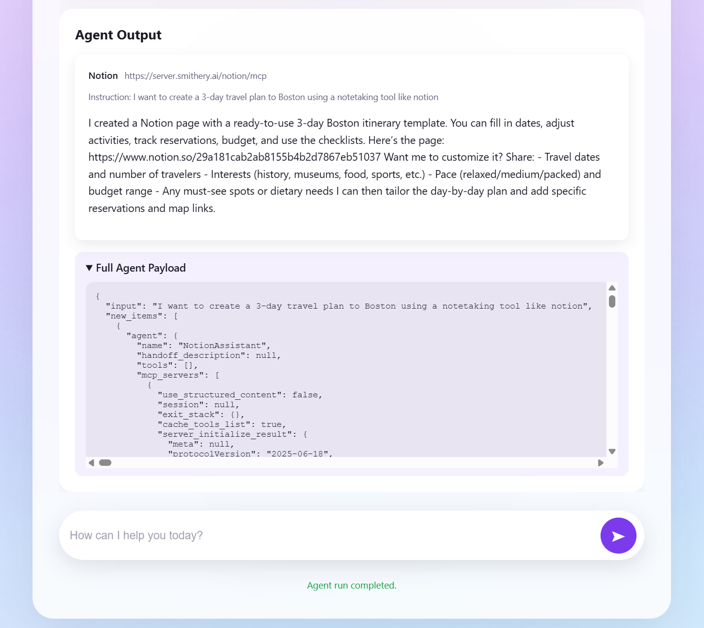

# AgentNet RAG search + MCP Execution
## Quickstart

0. Go to src/models
   ```bash
   cd src/models
   ```

1. Copy the example environment file and fill in your keys:
   ```bash
   cp .env.example .env
   ```

   ```.env
    OPENAI_API_KEY = 
    SMITHERY_API_KEY = # go to https://smithery.ai/ crreate an account and retrieve the API key
   ```

   In [smithery AI](https://smithery.ai/), search for Notion and complete the configuration of Notion credential. 

2. create a folder `secrets` and add the service-account.json with google cloud credential to the folder

3. create a folder `GCB` to store the ChromaDB mounted from google cloud bucket.


4. Build the image and start the stack (Postgres + dev container):
   ```bash
   docker compose -f src/models/docker-compose.yml up --build
   ```

5. Execute the workflow RAG search + MCP
    ```
    docker compose exec agentnet python main.py "What do you want to do"
    ```

6. Only Initiate the Docker image, but not the webapp
   ```
   docker compose -f src/models/docker-compose.yml run --rm agentnet /bin/bash
   ```
## Front End (under models/static)

1. Built as a lightweight FastAPI site (`app.py`) that serves templates/index.html plus the static bundle in `static/app.js` and `static/styles.css`.

2. `app.js` drives the UX: it posts to `/api/search` to fetch RAG-ranked MCP servers, renders them as selectable cards, and calls `/api/execute` to run the Notion agent against the chosen server.

3. `styles.css` supplies the glassmorphism look-and-feel, responsive layout, and accessibility-centric focus states.

4. Launch locally with `docker compose -f src/models/docker-compose.yml up` (or uvicorn app:create_app --reload inside the container) and visit http://localhost:8000 to use the browser client.


Interface:




## Data Pipeline

`parentPageExtract.py`: discover and scrape smithery AI MCP parent pages using BeautifulSoup to build a list of MCP servers from smithery AI webpage (id, discovery_url, minimal metadata) and write the result to `Data/mcp_servers.csv ` and save the downloaded HTML to `Data/HTMLData` folder I(did not commit due to size limit)

`childpageextract.py`: read servers.csv to get the HTTP link of each MCP server, visit each server entry to scrape full server details (tools, parameters, descriptions, endpoints, provider, tags), normalize fields, and write the result to `Data/mcp_server_tools.csv`

`mcp_to_json.py`: convert `Data/mcp_server_tools.csv` into a canonical agents.json (serialize rows into the expected JSON schema / `mcp` array or top-level `agent` objects), validate required fields, and write `Data/mcp_server_tools.json`

`RAG.py`: load agents.json, chunk content **by tool** (one chunk per tool including tool_name, tool_description, parameters, plus agent metadata), compute embeddings for each chunk, add texts+metadata to a Chroma collection persisted at DB/chroma_store, call persist(), and upload the DB/chroma_store directory to the configured Google Cloud Storage bucket

## RAG -> MCP workflow (Ex. Notion)
1. `main.py`: User enter a question.For example, "I want to create a  "I want to create a SQL study plan using a notetaking tool."

2. `RAG.py`: mount the ChromaDB stored in google cloud bucket to the docker container and retrieve the Top 3 most relevant MCP servers that meet the user's request

Results: 


3. `notion_agent.py`: receive the MCP link of the MCP server that the user pick and build the connection. The link is provided by smithery AI 

4. `main.py`: Prompt the user for a more detailed instruction and send to the MCP server of Notion to execute. 

5. Go to the Notion and found that SQL studyn plan created successfully.
Results:


Results from Notion page:


# CI / Testing
- Requires Python 3.11 locally to match GitHub Actions. Install tooling: `python -m pip install -r src/models/requirements-dev.txt`.
- Lint: `flake8 src/models tests`
- Tests with coverage (fails under 50% by config): `pytest`
- GitHub Actions runs the same steps on every push/PR via `.github/workflows/ci.yml` (checkout → install deps → byte-compile → lint → pytest with coverage).

# Frontend ↔ Backend
FastAPI (`src/models/app.py`) serves the template + static bundle and exposes two endpoints the browser calls. `/api/search` runs `async_rag_search`, which pulls embeddings from the Chroma store at `DB/chroma_store` (populated by the data pipeline that writes `Data/mcp_server_tools.json` → `RAG.py` indexing). `/api/execute` forwards the chosen server to `execute_mcp_workflow`, which runs the model/tooling stack and streams the result back to the UI.