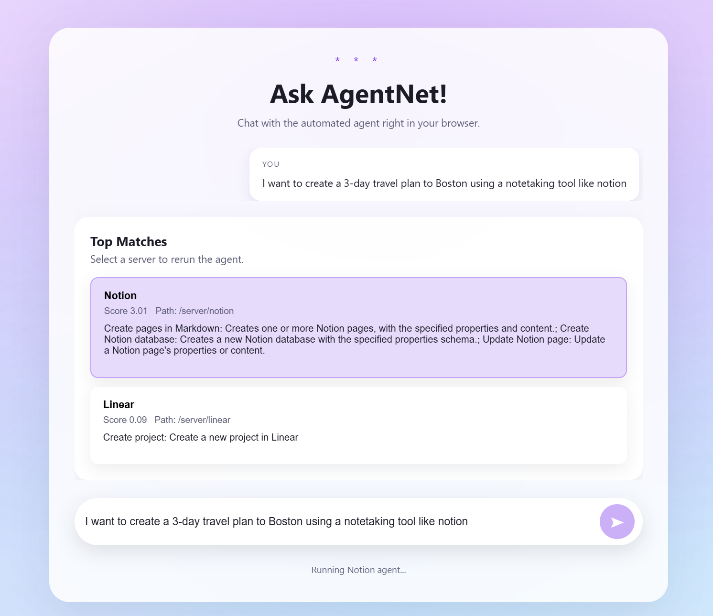
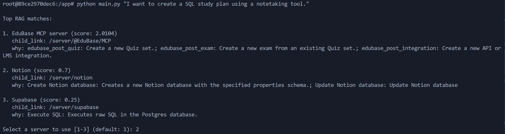
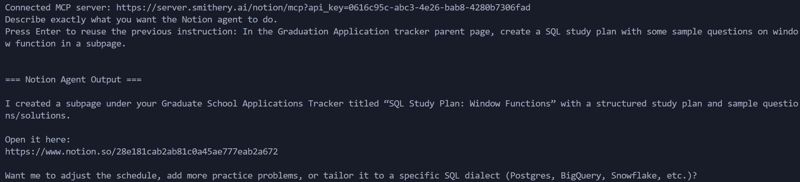
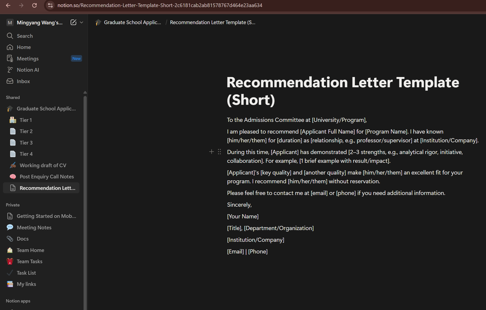
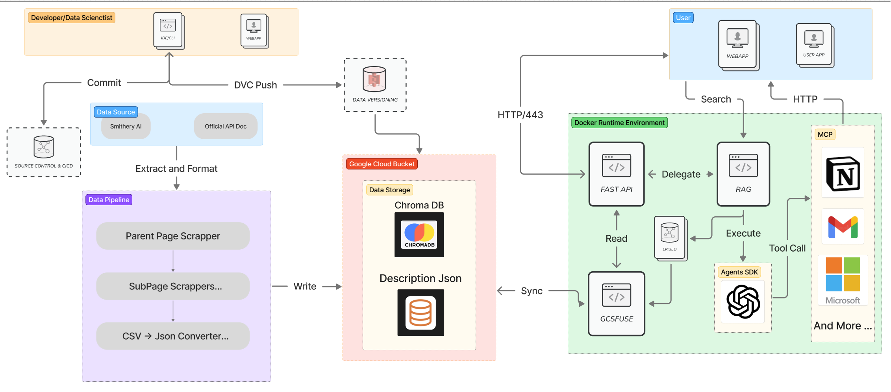
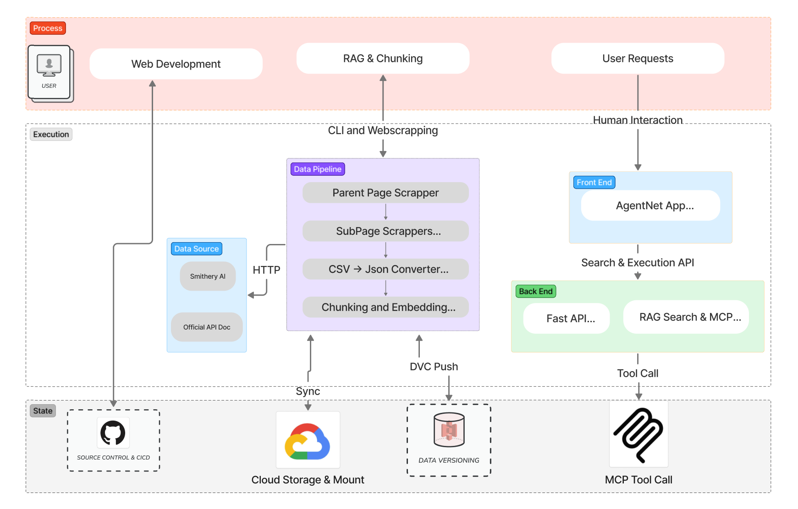

# AgentNet
## Overview

## Prerequisties
1. 

## Quickstart

0. Go to src/models
   ```bash
   cd src/models
   ```

1. Copy the example environment file and fill in your keys:
   ```bash
   cp .env.example .env
   ```

   ```.env
    OPENAI_API_KEY = 
    SMITHERY_API_KEY = # go to https://smithery.ai/ crreate an account and retrieve the API key
   ```

   In [smithery AI](https://smithery.ai/), search for Notion, Gmail or any other tools you want to useand complete the configuration. 

2. create a folder `secrets` in `src/models` and `src/deployment` and add key of your google service account.

3. create a folder `GCB` in `src/models` to store the ChromaDB mounted from google cloud bucket.

4. Build the image and start the stack (dev container in development mode):
   ```bash
   docker compose -f src/models/docker-compose.yml up --build
   ```

5. Only Initiate the Docker image, but not the webapp
   ```
   docker compose -f src/models/docker-compose.yml run --rm agentnet /bin/bash
   ```

6. Directly start the webapp with Docker locally
   ```
   docker compose -f src/models/docker-compose.yml up
   ```
   API: http://localhost:8000, Frontend: http://localhost:8080 (frontend defaults to hitting `http://localhost:8000/api`; override `API_BASE_URL` if you use a different host/service)
## Deployment

## Data Pipeline (src/datapipeline)

This folder contains the data pipeline scripts to scrape MCP servers from webpage, store them in a CSV file, and convert them into a JSON file. It also include the docker container for Data Versioning. For Detailed information about DVC, please refer to [Data Versioning](docs\milestone4.md)

`parentPageExtract.py`: discover and scrape smithery AI MCP parent pages using BeautifulSoup to build a list of MCP servers from smithery AI webpage (id, discovery_url, minimal metadata) and write the result to `Data/mcp_servers.csv ` and save the downloaded HTML to `Data/HTMLData` folder I(did not commit due to size limit)

`childpageextract.py`: read servers.csv to get the HTTP link of each MCP server, visit each server entry to scrape full server details (tools, parameters, descriptions, endpoints, provider, tags), normalize fields, and write the result to `Data/mcp_server_tools.csv`

`mcp_to_json.py`: convert `Data/mcp_server_tools.csv` into a canonical agents.json (serialize rows into the expected JSON schema / `mcp` array or top-level `agent` objects), validate required fields, and write `Data/mcp_server_tools.json`

`mcp_description_csv_to_json.py`: Converts the server CSV `(id/name/child_link/description)` to JSON for RAG. It keeps
  provided numeric IDs or auto-increments, keys entries by child_link/name (first wins), and writes pretty JSON.
  Defaults: input `src/models/Data/mcp_description.csv`, output `src/models/Data/mcp_description.json`.

`RAG.py`:  CLI to build/query a Chroma store of those descriptions. ingest embeds and persists under `src/models/GCB`, reindexing when source size changes; search loads/repairs, runs similarity search, and ranks servers by weighted retrieval score with child links. Chunking: exactly one chunk per server—cleaned HTML/whitespace, an intent sentence from the first description sentence (200-char cap), formatted as `[Server: name], Use for: intent`, then full cleaned description.

## Front End (src/frontend-simple)
The UI now lives in `src/frontend-simple` and ships as its own static container. Run `bash src/frontend-simple/docker-shell.sh` to build and serve it on port 8080. On the front end, user can enter question to search for MCP servers and let out Agent execute the reuqests. 

1. Static bundle now lives under `src/frontend-simple` (HTML/CSS/JS + assets) and runs as its own container using `http-server`.
2. Configure the backend API base via `API_BASE_URL` (defaults to `http://localhost:8000/api`); in k8s/compose point it at the AgentNet API service DNS, e.g., `http://agentnet-api:8000/api`.
3. `app.js` drives the UX: it posts to `/api/search` to fetch RAG-ranked MCP servers, renders them as selectable cards, and calls `/api/execute` to run the Notion agent against the chosen server.
4. `styles.css` supplies the glassmorphism look-and-feel, responsive layout, and accessibility-centric focus states.

## Back End API Service (src/models)

1. FastAPI service (`src/models/app.py`) mounts static assets and exposes JSON APIs: `POST /api/search` runs the catalog RAG; `POST /api/execute` triggers the MCP/Notion agent and returns both final output and raw payload.
2. Retrieval layer (`workflow.py`, `RAG.py`) builds or loads a Chroma vector store (`persist_dir`) from the MCP catalog, supports force reindexing, and ranks servers/tools via `top_servers` and `k_tools` before handing a selection to execution.
3. MCP execution (`workflow.py`, `notion_agent.py`) derives each MCP URL from the catalog `child_link`, invokes the Agents SDK to run the task, and returns an envelope with the MCP URL, final output, and diagnostics for the UI.

## Usage Detail RAG -> MCP workflow (Ex. Notion)
1. `main.py`: User enter a question.For example, "I want to create a  "I want to create a SQL study plan using a notetaking tool."

2. `RAG.py`: mount the ChromaDB stored in google cloud bucket to the docker container and retrieve the Top 3 most relevant MCP servers that meet the user's request

Results: 


3. `notion_agent.py`: receive the MCP link of the MCP server that the user pick and build the connection. The link is provided by smithery AI 

4. `main.py`: Prompt the user for a more detailed instruction and send to the MCP server of Notion to execute. 

5. Go to the Notion and found that recommendation letter template created successfully.
Results:


Results from Notion page:


# CI / Testing
- Requires Python 3.11 locally to match GitHub Actions. Install tooling: `python -m pip install -r src/models/requirements-dev.txt`.
- Lint: `flake8 src/models tests`
- Tests with coverage (fails under 50% by config): `pytest`
- GitHub Actions runs the same steps on every push/PR via `.github/workflows/ci.yml` (checkout → install deps → byte-compile → lint → pytest with coverage).

# Technical Architecture


# Solution Architecture



