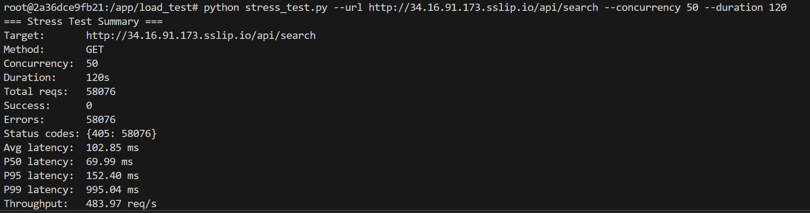
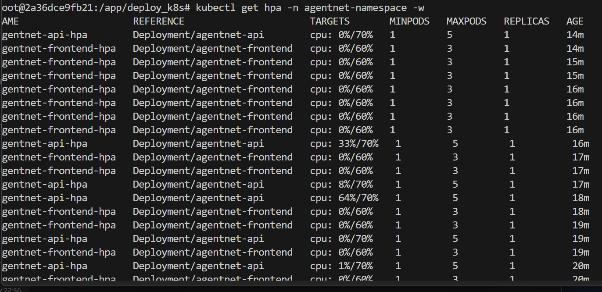

# AgentNet
## Overview
AgentNET turns AI agents from hard‑coded toolboxes into a search-and-execute layer: MCP is the universal plug; RAG finds the right MCP server on demand; the agent connects and runs it (e.g., discovers Gmail, drafts/sends the      
  email).                                                                                                                                                                                                                               
                                                                                                                                                                                                                                        
  - Problem: Agents are “brains in jars”—smart but isolated. Hard-coding integrations doesn’t scale across thousands of tools.                                                                                                          
  - What it does: Uses semantic search over a registry of MCP servers to suggest the best-fit tool for a natural-language goal, then executes through that server.                                                                      
  - Backend (`src/models`): `FastAPI /api/search` (RAG over Chroma) and `/api/execute` (MCP workflow); core logic in `RAG.py`, `workflow.py`, `notion_agent.py`, CLI in `main.py`; Docker compose/entrypoint for local or container runs.             
  - Data pipeline (`src/datapipeline`): Scrapes Smithery MCP listings (`parentPageExtract.py`, `childPageExtract.py`), normalizes to CSV/JSON (`mcp_csv_to_json.py`, `mcp_description_csv_to_json.py`), feeds RAG index.                          
  - Frontend (`src/frontend-simple`): Static UI hitting the API; configurable API_BASE_URL; packaged with its own Dockerfile.                                                                                                             
## Prerequisite
1. Smithary AI Account
2. Google Cloud Account + Google Cloud Service Account
3. Openai Account with API key
(Optional)
4. Notion, Google, Microsoft accounts

## Quickstart

0. Go to src/models
   ```bash
   cd src/models
   ```

1. Copy the example environment file and fill in your keys:
   ```bash
   cp .env.example .env
   ```

   ```.env
    OPENAI_API_KEY = 
    SMITHERY_API_KEY = # go to https://smithery.ai/ crreate an account and retrieve the API key
   ```

   In [smithery AI](https://smithery.ai/), search for Notion, Gmail or any other tools you want to useand complete the configuration. 

2. create a folder `secrets` in `src/models` and `src/deployment` and add key of your google service account.

3. create a folder `GCB` in `src/models` to store the ChromaDB mounted from google cloud bucket.

4. Build the image and start the stack (dev container in development mode):
   ```bash
   docker compose -f src/models/docker-compose.yml up --build
   ```

5. Only Initiate the Docker image, but not the webapp
   ```
   docker compose -f src/models/docker-compose.yml run --rm agentnet /bin/bash
   ```

6. Directly start the webapp with Docker locally
   ```
   docker compose -f src/models/docker-compose.yml up
   ```
   API: http://localhost:8000, Frontend: http://localhost:8080 (frontend defaults to hitting `http://localhost:8000/api`; override `API_BASE_URL` if you use a different host/service)
## Deployment
### Quick Start
Run the following command to deploy the stack:
```bash
bash src/deployment/docker-shell.sh
```
### API's to enable in GCP before you begin
Search for each of these in the GCP search bar and click enable to enable these API's
* Compute Engine API
* Service Usage API
* Cloud Resource Manager API
* Artifact Registry API

#### Setup GCP Service Account for deployment
- Here are the step to create a service account:
- To setup a service account you will need to go to [GCP Console](https://console.cloud.google.com/home/dashboard), search for  "Service accounts" from the top search box. or go to: "IAM & Admins" > "Service accounts" from the top-left menu and create a new service account called "deployment". 
- Give the following roles:
- For `deployment`:
    - Compute Admin
    - Compute OS Login
    - Artifact Registry Administrator
    - Kubernetes Engine Admin
    - Service Account User
    - Storage Admin
- Then click done.
- This will create a service account
- On the right "Actions" column click the vertical ... and select "Create key". A prompt for Create private key for "deployment" will appear select "JSON" and click create. This will download a Private key json file to your computer. Copy this json file into the **secrets** folder.
- Rename the json key file to `deployment.json`
- Follow the same process Create another service account called `gcp-service`
- For `gcp-service` give the following roles:
    - Storage Object Viewer
    - Vertex AI Administrator
    - Artifact Registry Reader
- Then click done.
- This will create a service account
- On the right "Actions" column click the vertical ... and select "Create key". A prompt for Create private key for "gcp-service" will appear select "JSON" and click create. This will download a Private key json file to your computer. Copy this json file into the **secrets** folder.
- Rename the json key file to `gcp-service.json`

### Setup Docker Container (Pulumi, Docker, Kubernetes)

Rather than each of you installing different tools for deployment we will use Docker to build and run a standard container will all required software.

#### Run `deployment` container
- Go into `docker-shell.sh` and change `GCP_PROJECT` to your project id
- Run `bash src/deployment/docker-shell.sh` on windows `sh src/deployment.docker-shell.sh` on Mac 

- Check versions of tools:
```
gcloud --version
pulumi version
kubectl version --client
```

- Check to make sure you are authenticated to GCP
- Run `gcloud auth list`

### SSH Setup
#### Configuring OS Login for service account
Run this within the `deployment` container
```
gcloud compute project-info add-metadata --project <YOUR GCP_PROJECT> --metadata enable-oslogin=TRUE
```
example: 
```
gcloud compute project-info add-metadata --project ac215-project --metadata enable-oslogin=TRUE
```

#### Create SSH key for service account
```
cd /secrets
ssh-keygen -f ssh-key-deployment
cd /app
```

#### Providing public SSH keys to instances
```
gcloud compute os-login ssh-keys add --key-file=/secrets/ssh-key-deployment.pub
```
### Deployment with Scaling using Kubernetes

In this section we will deploy the cheese app to a K8s cluster

### API's to enable in GCP for Project
Search for each of these in the GCP search bar and click enable to enable these API's
* Compute Engine API
* Service Usage API
* Cloud Resource Manager API
* Artifact Registry API
* Kubernetes Engine API

### Start Deployment Docker Container
-  `cd deployment`
- Run `sh docker-shell.sh`
- Check versions of tools
`gcloud --version`
`kubectl version`
`kubectl version --client`

- Check if make sure you are authenticated to GCP
- Run `gcloud auth list`

### Build and Push Docker Containers to GCR
**This step is only required if you have NOT already done this**
- cd into `deploy_images`
- When setting up pulumi for the first time run:
```
pulumi stack init dev
pulumi config set gcp:project ac215-project --stack dev
```

This will save all your deployment states to a GCP bucket

- If a stack has already been setup, you can preview deployment using:
```
pulumi preview --stack dev
```

- To build & push images run (This will take a while since we need to build 3 containers):
```
pulumi up --stack dev -y
```

### Create & Deploy Cluster
- cd into `deploy_k8s` from the `deployment` folder
- When setting up pulumi for the first time run:
```
pulumi stack init dev
pulumi config set gcp:project ac215-project
pulumi config set security:gcp_service_account_email <service account>@<Your account>.iam.gserviceaccount.com --stack dev
pulumi config set security:gcp_ksa_service_account_email <service account>@<Your account>.iam.gserviceaccount.com --stack dev
```
This will save all your deployment states to a GCP bucket

- If a stack has already been setup, you can preview deployment using:
```
pulumi preview --stack dev --refresh
```

- To create a cluster and deploy all our container images run:
```
pulumi up --stack dev --refresh -y
```

### Update deployment
Inside the docker run 
```
bash deploy.sh
```

### Debug
If got into an error such `unready container` or `exceed context limi`, run the command below
```
# review the current available container
kubectl  get pods -A -w

# authenticate
gcloud container clusters get-credentials agentnet-cluster --region us-central1 --project <Your Project Name>

# release pods
kubectl -n agentnet-namespace scale deployment agentnet-api --replicas 0
```

## Data Pipeline (src/datapipeline)

This folder contains the data pipeline scripts to scrape MCP servers from webpage, store them in a CSV file, and convert them into a JSON file. It also include the docker container for Data Versioning. For Detailed information about DVC, please refer to [Data Versioning](docs\milestone4.md)

`parentPageExtract.py`: discover and scrape smithery AI MCP parent pages using BeautifulSoup to build a list of MCP servers from smithery AI webpage (id, discovery_url, minimal metadata) and write the result to `Data/mcp_servers.csv ` and save the downloaded HTML to `Data/HTMLData` folder I(did not commit due to size limit)

`childpageextract.py`: read servers.csv to get the HTTP link of each MCP server, visit each server entry to scrape full server details (tools, parameters, descriptions, endpoints, provider, tags), normalize fields, and write the result to `Data/mcp_server_tools.csv`

`mcp_to_json.py`: convert `Data/mcp_server_tools.csv` into a canonical agents.json (serialize rows into the expected JSON schema / `mcp` array or top-level `agent` objects), validate required fields, and write `Data/mcp_server_tools.json`

`mcp_description_csv_to_json.py`: Converts the server CSV `(id/name/child_link/description)` to JSON for RAG. It keeps
  provided numeric IDs or auto-increments, keys entries by child_link/name (first wins), and writes pretty JSON.
  Defaults: input `src/models/Data/mcp_description.csv`, output `src/models/Data/mcp_description.json`.

`RAG.py`:  CLI to build/query a Chroma store of those descriptions. ingest embeds and persists under `src/models/GCB`, reindexing when source size changes; search loads/repairs, runs similarity search, and ranks servers by weighted retrieval score with child links. Chunking: exactly one chunk per server—cleaned HTML/whitespace, an intent sentence from the first description sentence (200-char cap), formatted as `[Server: name], Use for: intent`, then full cleaned description.

## Front End (src/frontend-simple)
The UI now lives in `src/frontend-simple` and ships as its own static container. Run `bash src/frontend-simple/docker-shell.sh` to build and serve it on port 8080. On the front end, user can enter question to search for MCP servers and let out Agent execute the reuqests. 

1. Static bundle now lives under `src/frontend-simple` (HTML/CSS/JS + assets) and runs as its own container using `http-server`.
2. Configure the backend API base via `API_BASE_URL` (defaults to `http://localhost:8000/api`); in k8s/compose point it at the AgentNet API service DNS, e.g., `http://agentnet-api:8000/api`.
3. `app.js` drives the UX: it posts to `/api/search` to fetch RAG-ranked MCP servers, renders them as selectable cards, and calls `/api/execute` to run the Notion agent against the chosen server.
4. `styles.css` supplies the glassmorphism look-and-feel, responsive layout, and accessibility-centric focus states.

## Back End API Service (src/models)

1. FastAPI service (`src/models/app.py`) mounts static assets and exposes JSON APIs: `POST /api/search` runs the catalog RAG; `POST /api/execute` triggers the MCP/Notion agent and returns both final output and raw payload.
2. Retrieval layer (`workflow.py`, `RAG.py`) builds or loads a Chroma vector store (`persist_dir`) from the MCP catalog, supports force reindexing, and ranks servers/tools via `top_servers` and `k_tools` before handing a selection to execution.
3. MCP execution (`workflow.py`, `notion_agent.py`) derives each MCP URL from the catalog `child_link`, invokes the Agents SDK to run the task, and returns an envelope with the MCP URL, final output, and diagnostics for the UI.

## Usage Detail RAG -> MCP workflow (Ex. Notion)
1. `main.py`: User enter a question.For example, "I want to create a  "I want to create a SQL study plan using a notetaking tool."

2. `RAG.py`: mount the ChromaDB stored in google cloud bucket to the docker container and retrieve the Top 3 most relevant MCP servers that meet the user's request

Results: 


3. `notion_agent.py`: receive the MCP link of the MCP server that the user pick and build the connection. The link is provided by smithery AI 

4. `main.py`: Prompt the user for a more detailed instruction and send to the MCP server of Notion to execute. 

5. Go to the Notion and found that recommendation letter template created successfully.
Results:


Results from Notion page:


# CI / Testing
- Requires Python 3.11 locally to match GitHub Actions. Install tooling: `python -m pip install -r src/models/requirements-dev.txt`.
- Lint: `flake8 src/models tests`
- Tests with coverage (fails under 50% by config): `pytest`
- GitHub Actions runs the same steps on every push/PR via `.github/workflows/ci.yml` (checkout → install deps → byte-compile → lint → pytest with coverage).

# Technical Architecture


# Solution Architecture


# Scalability (sr/deployment/load_test)





# Known Issues
- The Rag search can be slow for the first time, it will be much faster after the first search.
- The execution process is slow because we have to go through a few services.
- Need to release the replica every deployment update to avoid unhealthy container. 
  
