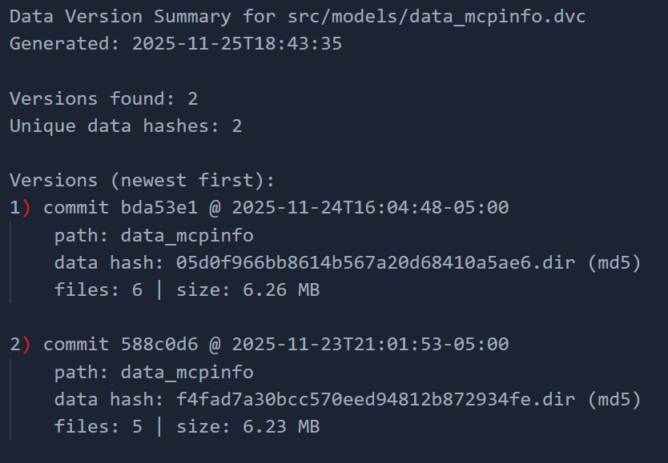
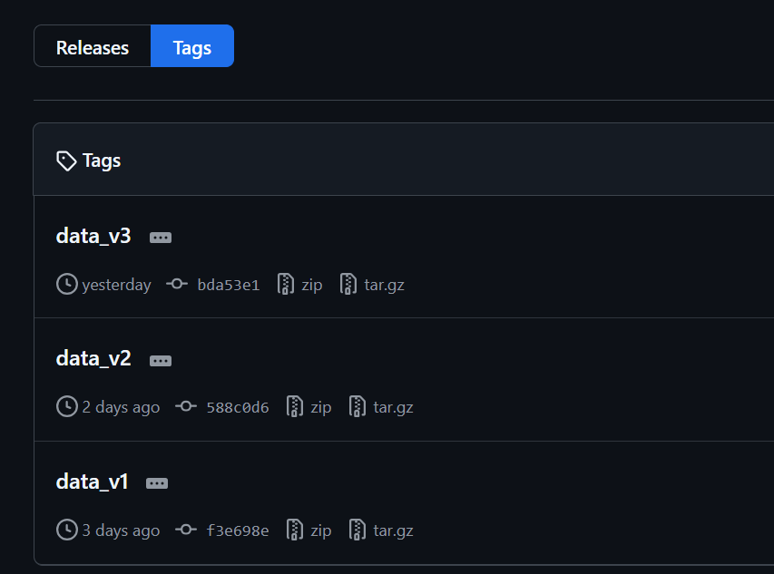
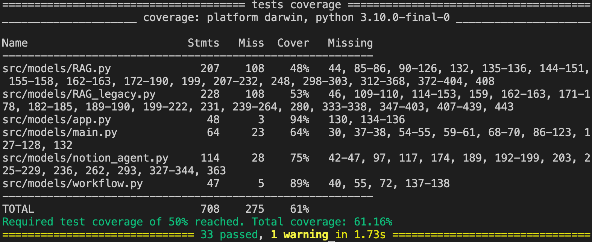

# Milestone4 Documentation

## Technical Architecture


## Solution Architecture


## Front End (under models/static)

1. Built as a lightweight FastAPI site (`app.py`) that serves `templates/index.html` plus the static bundle in `static/app.js` and `static/styles.css`.
2. `app.js` drives the UX: it posts to `/api/search` to fetch RAG-ranked MCP servers, renders them as selectable cards, and calls `/api/execute` to run the Notion agent against the chosen server.
3. `styles.css` supplies the glassmorphism look-and-feel, responsive layout, and accessibility-centric focus states.

## Back End

1. FastAPI service (`src/models/app.py`) mounts static assets and exposes JSON APIs: `POST /api/search` runs the catalog RAG; `POST /api/execute` triggers the MCP/Notion agent and returns both final output and raw payload.
2. Retrieval layer (`workflow.py`, `RAG.py`) builds or loads a Chroma vector store (`persist_dir`) from the MCP catalog, supports force reindexing, and ranks servers/tools via `top_servers` and `k_tools` before handing a selection to execution.
3. MCP execution (`workflow.py`, `notion_agent.py`) derives each MCP URL from the catalog `child_link`, invokes the Agents SDK to run the task, and returns an envelope with the MCP URL, final output, and diagnostics for the UI.
4. Data prep scripts (`parentPageExtract.py`, `childpageextract.py`, `mcp_to_json.py`, `mcp_description_csv_to_json.py`) keep the catalog fresh; outputs are DVC-tracked so code and data stay aligned for any git revision.

Interface running sample:


## Data Versioning
### Current Data Versioning Summary
Run to generate a summary and history of data versioning in a text file
```
python docs/summarize_data_versions.py
```


Github Tags:


### Logic and workflow
- We track the dataset under `src/models/data_mcpinfo` with DVC; git stores only the small `.dvc` pointer while the actual data lives in the remote bucket.
- Default remote (`src/models/data_mcpinfo`) points to `gs://agentnet215/dvc_store`, so `dvc push` uploads data there and `dvc pull` retrieves the correct snapshot for any git commit.
- Typical cycle: modify data -> `dvc add data_mcpinfo` to capture the new hash/size -> `git commit` the updated `.dvc` + config -> `dvc push` to upload blobs -> optional git tag for the dataset version.
- Repro users align code and data by checking out a git revision and running `dvc pull` (fetches the exact data hash referenced by that commit).

### Setup and adding a new version
1) Run `docker-shell.sh`  
   - From the repo root, start the dev shell that has DVC installed:  
   - On Mac: `sh docker-shell.sh`
   - On Windows: `bash docker-shell.sh`

2) Initialize DVC (only if starting fresh)  
   - `dvc init`

3) Configure the remote registry (already set to GCS in this repo)  
   - To (re)point the default remote to our bucket:  
     `dvc remote add -d src/models/data_mcpinfo gs://agentnet215/dvc_store`  
   - Replace the bucket if you are using your own GCS path.

4) Track the dataset changes  
   - From `src/models`: `dvc add data_mcpinfo`

5) Push the data to the remote registry  
   - `dvc push`
   - You can verify the pushed objects under the bucket folder `dvc_store`.

6) Commit and tag in git (run outside the container if you prefer)  
   - `git status`  
   - `git add src/models/data_mcpinfo.dvc .dvc/config`  
   - `git commit -m "Update data_mcpinfo vN"`  
   - Optional dataset tag: `git tag -a dataset_vN -m "tag dataset"`  
   - Add a remote origin `git remote add origin git@github.com:chrischenhub/AgentNet.git` Replace with your username and repo name
   - Push code and tag together: `git push --atomic origin main dataset_vN`

## CI / Testing
- Requires Python 3.11 locally to match GitHub Actions. Install tooling: `python -m pip install -r src/models/requirements-dev.txt`.
- Lint: `flake8 src/models tests`
- Tests with coverage (fails under 50% by config): `pytest`
- GitHub Actions runs the same steps on every push/PR via `.github/workflows/ci.yml` (checkout -> install deps -> byte-compile -> lint -> pytest with coverage).
- CI/CD running example:  


## MCP 
In this milestone, we changed the webscraping code in `src/datapipline` folder to fit the new HTML structure in the MCP link website and make sure the webscraping still works. 

We collected 20+ more new MCPs, including the MCP for Google Apps such as Gmail, Google Maps, Google Dock, etc

## RAG Chunking Strategy Update
Legacy chunking in `RAG_legacy.py` embedded one chunk per tool (name/slug/params), so as MCP coverage grew and tool counts exploded the vector store ballooned and searches had to scan thousands of vectors. The new `RAG.py` collapses to one chunk per server with a `[Server: name] headline plus a concise “Use for” intent from the description`, avoiding tool-level explosion while keeping child_link for routing. That trims embeddings to roughly one chunk per MCP, so similarity search and scoring run over far fewer vectors. Ranking now needs only a small k_tools to pick top servers instead of sifting through every tool. With more MCPs onboarded the old tool-centric search was taking ~2 minutes to return results; the server-level chunking brings latency back to interactive speed.
